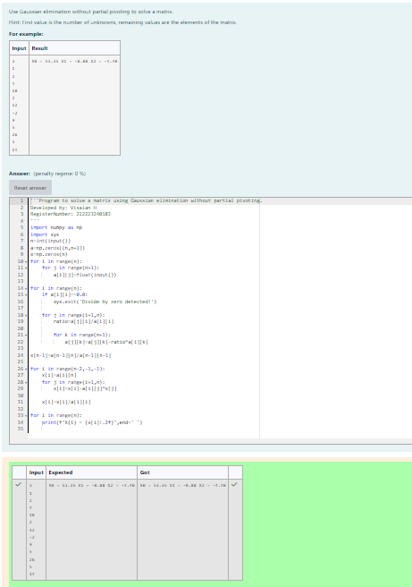

# Gaussian Elimination

## AIM:
To write a program to find the solution of a matrix using Gaussian Elimination.

## Equipments Required:
1. Hardware – PCs
2. Anaconda – Python 3.7 Installation / Moodle-Code Runner

## Algorithm
1. Start the program.
2. Take input from the user for the number of equations n and the coefficients of the equations.
3. Perform Gaussian elimination with partial pivoting to convert the coefficient matrix into upper triangular form. While performing elimination, check for the possibility of division by zero.
4. Use back substitution to find the values of the variables starting from the last equation and working upwards.
5. Print the values of the variables.
## Program:
```
'''Program to solve a matrix using Gaussian elimination without partial pivoting.
Developed by: Visalan H
RegisterNumber: 212223240183
'''
import numpy as np
import sys
n=int(input())
a=np.zeros((n,n+1))
x=np.zeros(n)
for i in range(n):
    for j in range(n+1):
        a[i][j]=float(input())

for i in range(n):
    if a[i][i]==0.0:
        sys.exit('Divide by zero detected!')
        
    for j in range(i+1,n):
        ratio=a[j][i]/a[i][i]
        
        for k in range(n+1):
            a[j][k]=a[j][k]-ratio*a[i][k]

x[n-1]=a[n-1][n]/a[n-1][n-1]

for i in range(n-2,-1,-1):
    x[i]=a[i][n]
    for j in range(i+1,n):
        x[i]=x[i]-a[i][j]*x[j]
    
    x[i]=x[i]/a[i][i]
    
for i in range(n):
    print(f"X{i} = {x[i]:.2f}",end=' ')
        
```

## Output:


## Result:
Thus the program to find the solution of a matrix using Gaussian Elimination is written and verified using python programming.

